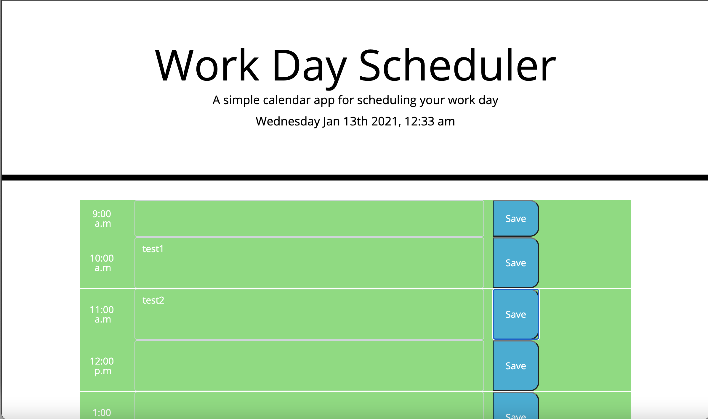
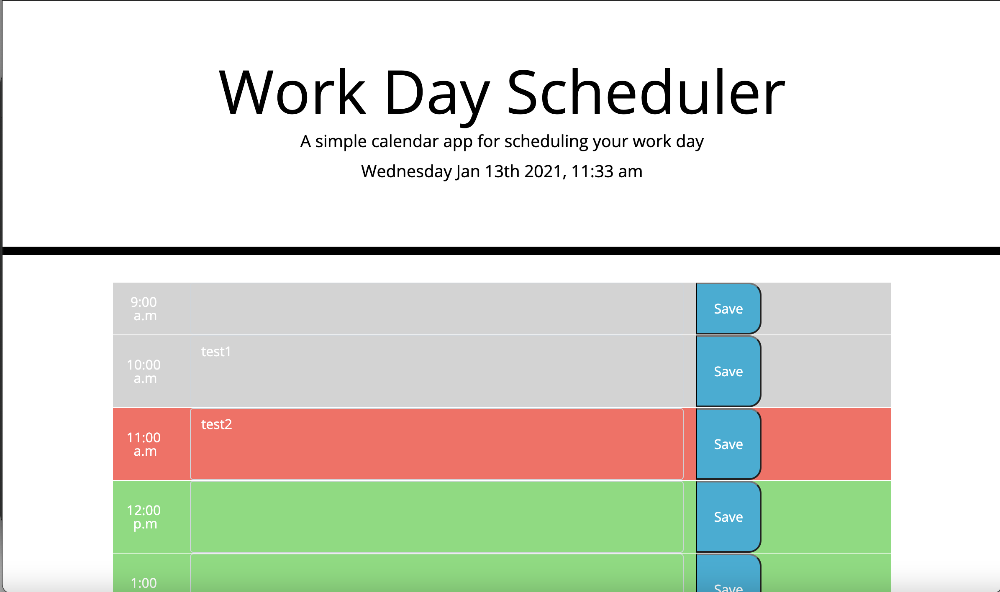

# day-planner-jquery

For this project we were tasked with creating a day planner for the hours 9am-5pm to log potential appointments and save them into our local storage so when we refreshed the page they would stay in the correct time slot. We also had to color-coat hours that had already passed, the current hour time slot, as well as future time slots. I used the 3rd party API moment.js to display the current time also. I encountered a fatal error when deleting folders that I no longer needed and also changed file pathing and their directories so I had to create a new repo to push my previous work to. Both are linked below.

Old Repo: https://github.com/slimeforest/day-planner-jquery
New Repo: https://github.com/slimeforest/new-day-planner
New Live Page: https://slimeforest.github.io/new-day-planner/

Screenshots:

